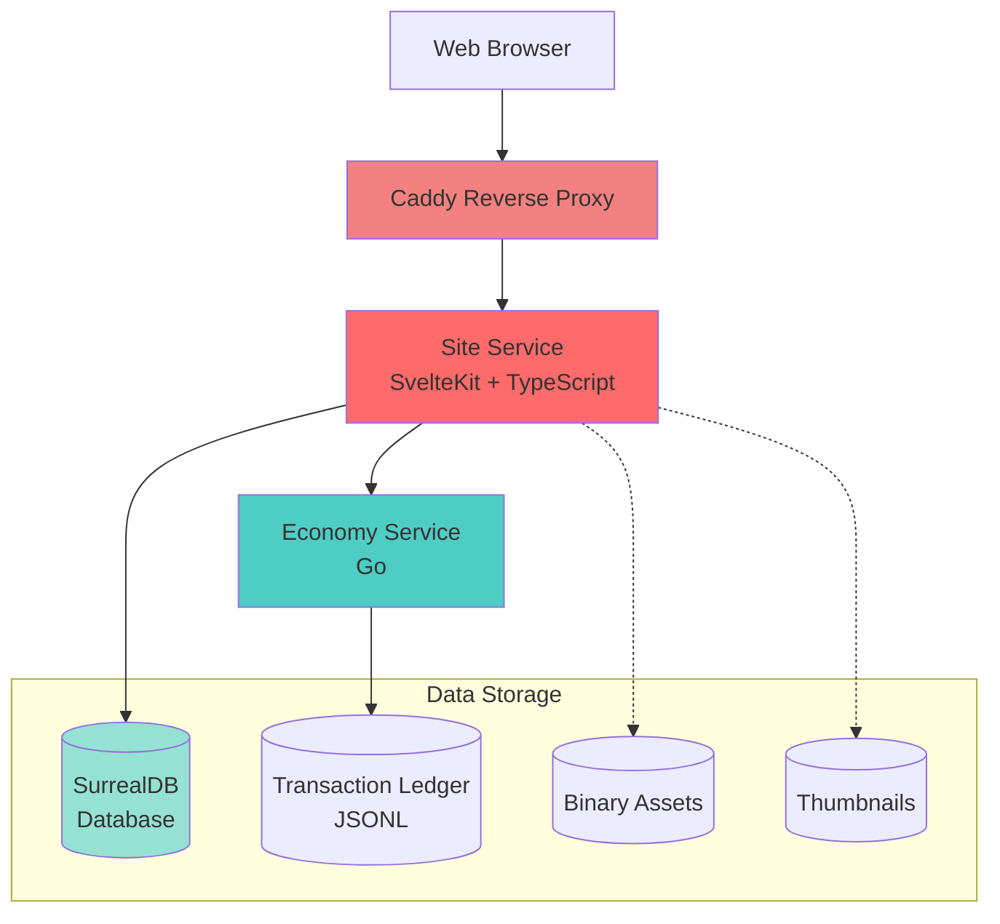
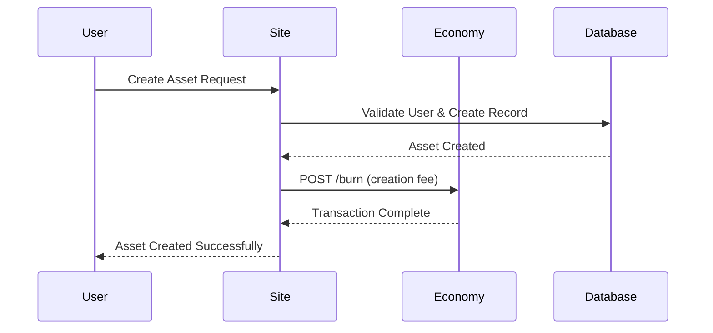
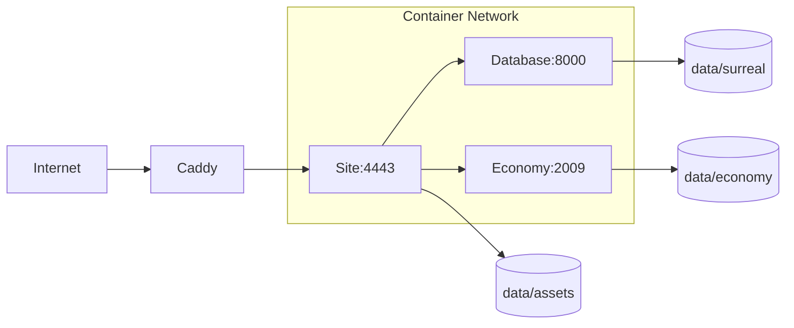

Mercury Core is built as a modern, microservices-oriented platform with three main components that work together to create a complete MMO game creation platform.

## Architecture Overview



## Core Components

### Site Service

The Site service is the main web application built with:

- **SvelteKit**: Full-stack framework for building the web interface
- **Svelte**: Reactive UI framework that compiles to vanilla JavaScript
- **TypeScript**: Type-safe JavaScript for better code quality
- **Vite**: Fast build tool and dev server with hot module replacement

The Site service handles:
- User authentication and sessions
- Asset management (catalog, inventory)
- Social features (friends, groups, forums)
- Game/place hosting coordination
- Administrative functions
- Real-time updates and notifications

### Economy Service

A standalone microservice written in **Go** that manages:

- Currency transactions between users
- Minting (creating) and burning (destroying) currency
- Asset ownership transfers
- Daily stipends for users
- Transaction ledger persistence

The Economy service runs independently on port 2009 and exposes a REST API for the Site service to consume.

### Database Service

**SurrealDB** serves as the primary data store, providing:

- Multi-model database (document, graph, relational)
- Schema enforcement with flexible queries
- Real-time subscriptions
- Graph relationships for social features
- Native WebSocket support

SurrealDB runs on port 8000 and uses the SurrealKV storage engine.

## Service Communication



## Data Flow

### User Authentication

1. User submits credentials to Site service
2. Site queries SurrealDB for user record
3. Password hash verification
4. Session token created in database
5. Cookie set in user's browser

### Asset Purchase

1. User initiates purchase through Site
2. Site validates asset availability in SurrealDB
3. Economy service executes transaction
4. Site creates ownership relation in SurrealDB
5. Economy service records transaction in ledger

### Game Server Connection

1. User clicks "Play" on a game
2. Site generates authentication ticket
3. Client receives server address and ticket
4. Client connects directly to game server
5. Site updates playing status in SurrealDB

## Deployment Architecture

### Development Mode

```bash
# Site service starts both SurrealDB and Economy automatically
bun dev
```

The Site service manages child processes for dependencies when running in development.

### Production Mode



Production deployments use Docker Compose to orchestrate all three services:

- **Caddy** handles HTTPS termination and reverse proxying
- **Site, Database, and Economy** run as separate containers
- Persistent volumes store all data
- Services restart automatically on failure

## Technology Stack Summary

| Component | Technology | Purpose |
|-----------|-----------|----------|
| Frontend | Svelte | Reactive UI components |
| Backend | SvelteKit | Server-side rendering, API routes |
| Language | TypeScript | Type safety across codebase |
| Database | SurrealDB | Multi-model data storage |
| Economy | Go | High-performance transaction ledger |
| Build Tool | Vite | Fast development and production builds |
| Runtime | Bun | JavaScript/TypeScript runtime |
| Proxy | Caddy | HTTPS and reverse proxy |
| Containers | Docker | Service orchestration |

## Process Management

The Site service includes built-in process management for its dependencies:

**SurrealDB Lifecycle** (Site/src/lib/server/process/surreal.ts:6-40)
```typescript
// Automatically starts SurrealDB if not running
// Manages graceful shutdown on exit
// Monitors process health
```

**Economy Service Lifecycle** (Site/src/lib/server/process/economy.ts:7-46)
```typescript
// Auto-builds from Go source if needed
// Spawns process and monitors health
// Coordinates shutdown with main process
```

This approach ensures all required services are available during development without manual intervention.

## Data Persistence

All persistent data is stored in the `data/` directory:

```
data/
├── surreal/          # SurrealDB database files
├── economy/ledger    # Transaction ledger (JSONL)
├── assets/           # Binary asset files (meshes, scripts)
├── thumbnails/       # Generated thumbnails
└── icons/            # Place icons
```

This directory should be:
- Excluded from version control
- Backed up regularly
- Mounted to persistent storage in production
- Given adequate disk space for growth

## Security Model

- **Authentication**: Session-based with secure cookies
- **Database**: Root credentials (should be changed in production)
- **Economy**: Internal service (not exposed publicly)
- **HTTPS**: Enforced by Caddy in production
- **Validation**: TypeScript types + SurrealDB schema
- **Asset Signing**: RSA private key for corescripts

## Scalability Considerations

The architecture supports horizontal scaling:

- **Site Service**: Can run multiple instances behind load balancer
- **Database**: SurrealDB supports clustering (future enhancement)
- **Economy Service**: Currently single-instance (ledger is append-only)
- **Static Assets**: Can be offloaded to CDN

## Next Steps

- [Services](/concepts/services) - Detailed service documentation
- [Database](/concepts/database) - SurrealDB schema and queries
- [Economy](/concepts/economy) - Economy system design
