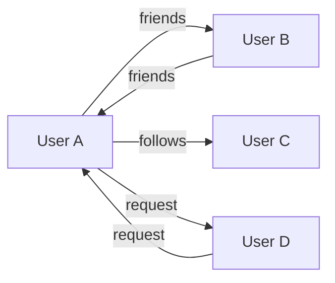

Mercury Core uses SurrealDB, a multi-model database that combines document, graph, and relational paradigms. The schema is defined in `Site/src/lib/server/init.surql` and initialized on every startup.

## Database Configuration

```
Namespace: main
Database: main
Storage Engine: surrealkv://
Connection: WebSocket (ws://localhost:8000)
Authentication: root:root (change in production!)
```

## Core Tables

### User Table

Stores user accounts and profiles.

```sql
DEFINE TABLE user SCHEMAFULL TYPE NORMAL;
  DEFINE FIELD admin ON user TYPE bool DEFAULT 
    count(SELECT 1 FROM user) == 0;  -- First user is admin
  DEFINE FIELD bodyColours ON user TYPE object;
    DEFINE FIELD bodyColours.Head ON user TYPE int;
    DEFINE FIELD bodyColours.LeftArm ON user TYPE int;
    DEFINE FIELD bodyColours.LeftLeg ON user TYPE int;
    DEFINE FIELD bodyColours.RightArm ON user TYPE int;
    DEFINE FIELD bodyColours.RightLeg ON user TYPE int;
    DEFINE FIELD bodyColours.Torso ON user TYPE int;
  DEFINE FIELD created ON user TYPE datetime DEFAULT time::now();
  DEFINE FIELD css ON user TYPE string DEFAULT ALWAYS "";
  DEFINE FIELD description ON user TYPE array<object> DEFAULT ALWAYS [];
    DEFINE FIELD description.*.text ON user TYPE string;
    DEFINE FIELD description.*.updated ON user TYPE datetime DEFAULT time::now();
  DEFINE FIELD email ON user TYPE string 
    ASSERT string::is_email($value) OR $value == "";
  DEFINE FIELD hashedPassword ON user TYPE string;
  DEFINE FIELD lastOnline ON user TYPE datetime DEFAULT time::now();
  DEFINE FIELD permissionLevel ON user TYPE int;
  DEFINE FIELD status ON user COMPUTED
    IF ->playing[WHERE valid AND ping > time::now() - 35s] {
      "Playing"
    } ELSE IF lastOnline > time::now() - 35s {
      "Online"
    } ELSE {
      "Offline"
    };
  DEFINE FIELD theme ON user TYPE int DEFAULT 0;
  DEFINE FIELD username ON user TYPE string;

DEFINE INDEX usernameI ON user COLUMNS username UNIQUE;
```

**Key Features:**
- First registered user automatically becomes admin
- Email validation via assertion
- Computed `status` field based on activity
- Description history tracking (array of objects)
- Custom CSS for profile pages

### Asset Table

Catalog items (clothing, gear, models, etc.).

```sql
DEFINE TABLE asset SCHEMAFULL TYPE NORMAL;
  -- Privileged assets: 8 digits (< 100000000)
  -- User assets: 9 digits (100000000-999999999)
  DEFINE FIELD id ON asset TYPE int;
  DEFINE FIELD created ON asset TYPE datetime DEFAULT time::now();
  DEFINE FIELD description ON asset TYPE array<object> DEFAULT ALWAYS [];
    DEFINE FIELD description.*.text ON asset TYPE string;
    DEFINE FIELD description.*.updated ON asset TYPE datetime DEFAULT time::now();
  DEFINE FIELD forSale ON asset TYPE bool DEFAULT true;
  DEFINE FIELD name ON asset TYPE string;
  DEFINE FIELD price ON asset TYPE int DEFAULT 0;
  DEFINE FIELD type ON asset TYPE int;  -- Asset type (hat, shirt, etc.)
  DEFINE FIELD updated ON asset TYPE datetime DEFAULT time::now();
  DEFINE FIELD visibility ON asset TYPE string DEFAULT "Pending";
```

**Asset Types:**
- 2: T-Shirt
- 8: Hat
- 11: Shirt
- 12: Pants
- 13: Decal
- 18: Face

**Visibility States:**
- `Pending`: Awaiting moderation
- `Visible`: Approved and public
- `Hidden`: Removed from public view

### Place Table

Game servers and experiences.

```sql
DEFINE TABLE place SCHEMAFULL TYPE NORMAL;
  DEFINE FIELD id ON place TYPE int;
  DEFINE FIELD created ON place TYPE datetime DEFAULT time::now();
  DEFINE FIELD dedicated ON place TYPE bool DEFAULT false;
  DEFINE FIELD deleted ON place TYPE bool DEFAULT false;
  DEFINE FIELD description ON place TYPE array<object> DEFAULT ALWAYS [];
  DEFINE FIELD maxPlayers ON place TYPE int DEFAULT 0;
  DEFINE FIELD name ON place TYPE string DEFAULT "";
  DEFINE FIELD privateServer ON place TYPE bool DEFAULT false;
  DEFINE FIELD privateTicket ON place TYPE string DEFAULT rand::id();
  DEFINE FIELD serverAddress ON place TYPE string DEFAULT "";
  DEFINE FIELD serverPing ON place TYPE int DEFAULT 0;
  DEFINE FIELD serverPort ON place TYPE int;
  DEFINE FIELD serverTicket ON place TYPE string DEFAULT rand::id();
  DEFINE FIELD updated ON place TYPE datetime DEFAULT time::now();
```

**Server Types:**
- **Dedicated**: Always-on server with fixed address
- **Dynamic**: On-demand server spawned by platform
- **Private**: Invitation-only via privateTicket

### Comment Table

Unified comment system for status posts, forum posts, and asset comments.

```sql
DEFINE TABLE comment SCHEMAFULL TYPE NORMAL;
  DEFINE FIELD author ON comment COMPUTED
    (SELECT status, username FROM $this<-createdComment<-user)[0];
  DEFINE FIELD content ON comment TYPE array<object> DEFAULT ALWAYS [];
    DEFINE FIELD content.*.text ON comment TYPE string;
    DEFINE FIELD content.*.updated ON comment TYPE datetime DEFAULT time::now();
  DEFINE FIELD created ON comment TYPE datetime DEFAULT time::now();
  DEFINE FIELD dislikes ON comment COMPUTED
    ($user IN $this<-dislikes<-user.id);
  DEFINE FIELD likes ON comment COMPUTED
    ($user IN $this<-likes<-user.id);
  DEFINE FIELD pinned ON comment TYPE bool DEFAULT false;
  DEFINE FIELD score ON comment COMPUTED
    count(<-likes) - count(<-dislikes);
  DEFINE FIELD type ON comment TYPE array;
    -- ["status"] -> status post
    -- ["status", "{statusId}"] -> status post reply
    -- ["forum", "{categoryId}"] -> forum post
    -- ["forum", "{categoryId}", "{postId}"] -> forum reply
    -- ["asset", "{assetId}"] -> asset comment
  DEFINE FIELD visibility ON comment TYPE string DEFAULT "Visible";
```

**Comment Types (polymorphic):**
- `["status"]`: User status post
- `["status", "abc123"]`: Reply to status post
- `["forum", "general"]`: Forum topic
- `["forum", "general", "xyz789"]`: Forum reply
- `["asset", "123456789"]`: Asset comment

**Computed Fields:**
- `author`: Fetches username via graph traversal
- `likes`/`dislikes`: Whether current user has liked/disliked
- `score`: Net votes (likes - dislikes)

## Graph Relationships

SurrealDB's graph capabilities model social features as edges.

### Social Graph



```sql
-- Bidirectional friendship
DEFINE TABLE friends SCHEMAFULL TYPE RELATION 
  FROM user TO user ENFORCED;
  DEFINE FIELD created ON friends TYPE datetime DEFAULT time::now();

-- Unidirectional follow
DEFINE TABLE follows SCHEMAFULL TYPE RELATION 
  FROM user TO user ENFORCED;
  DEFINE FIELD created ON follows TYPE datetime DEFAULT time::now();

-- Pending friend request
DEFINE TABLE request SCHEMAFULL TYPE RELATION 
  FROM user TO user ENFORCED;
  DEFINE FIELD created ON request TYPE datetime DEFAULT time::now();
```

### Content Relationships

```sql
-- User created comment
DEFINE TABLE createdComment SCHEMAFULL TYPE RELATION 
  FROM user TO comment;

-- User owns asset
DEFINE TABLE ownsAsset SCHEMAFULL TYPE RELATION 
  FROM user TO asset ENFORCED;
  DEFINE FIELD created ON ownsAsset TYPE datetime DEFAULT time::now();

-- User owns place
DEFINE TABLE ownsPlace SCHEMAFULL TYPE RELATION 
  FROM user TO place ENFORCED;

-- User owns group
DEFINE TABLE ownsGroup SCHEMAFULL TYPE RELATION 
  FROM user TO group;

-- User likes content
DEFINE TABLE likes SCHEMAFULL TYPE RELATION 
  FROM user TO asset | comment | place ENFORCED;
  DEFINE FIELD created ON likes TYPE datetime DEFAULT time::now();

-- User dislikes content
DEFINE TABLE dislikes SCHEMAFULL TYPE RELATION 
  FROM user TO asset | comment | place ENFORCED;
  DEFINE FIELD created ON dislikes TYPE datetime DEFAULT time::now();
```

### Session Management

```sql
DEFINE TABLE session SCHEMAFULL TYPE NORMAL;
  DEFINE FIELD created ON session TYPE datetime DEFAULT time::now();
  DEFINE FIELD expires ON session TYPE datetime DEFAULT time::now() + 30d;

DEFINE TABLE hasSession SCHEMAFULL TYPE RELATION 
  FROM user TO session ENFORCED;
```

Sessions expire after 30 days. The Site service validates sessions on each request.

## Custom Functions

SurrealDB supports custom functions for reusable logic.

### fn::assetId()

Generate random 9-digit asset ID:

```sql
DEFINE FUNCTION fn::assetId() {
  RETURN rand::int(100_000_000, 999_999_999);
};
```

### fn::auditLog()

Create audit log entry:

```sql
DEFINE FUNCTION fn::auditLog($action: string, $note: string, $user: record) {
  CREATE auditLog CONTENT {
    action: $action,
    note: $note,
    user: $user,
  };
};
```

### fn::notify()

Create notification:

```sql
DEFINE FUNCTION fn::notify(
  $sender: record, 
  $receiver: record, 
  $type: string, 
  $note: string, 
  $relativeId: string
) {
  RETURN RELATE $sender->notification->$receiver CONTENT {
    note: $note,
    read: false,
    relativeId: $relativeId,
    type: $type,
  };
};
```

### fn::getComments()

Recursively fetch nested comments (up to 10 levels deep):

```sql
DEFINE FUNCTION fn::getComments(
  $comment: record<comment>, 
  $depth: number, 
  $user: record<user>
) {
  IF $depth > 9 {
    RETURN [];
  };

  RETURN SELECT
    record::id(id) AS id,
    author,
    content,
    array::flatten(
      (SELECT fn::getComments($this.id, $depth + 1, $user) AS comments
       FROM $comment<-commentLink<-comment
       ORDER BY pinned DESC, score DESC).comments
    ) AS comments,
    created,
    likes,
    dislikes,
    pinned,
    score,
    type,
    visibility
  FROM $comment;
};
```

## Event Triggers

Automatic audit logging for administrative actions.

```sql
-- Log banner creation
DEFINE EVENT bannerCreateLog ON TABLE banner
WHEN $event = "CREATE" THEN
  fn::auditLog("Administration", 
    string::concat('Create banner "', $after.body, '"'), 
    $after.creator);

-- Log banner deletion
DEFINE EVENT bannerDeleteLog ON TABLE banner
WHEN $event = "UPDATE" AND !$before.deleted AND $after.deleted THEN
  fn::auditLog("Administration", 
    string::concat('Delete banner "', $after.body, '"'), 
    $after.creator);

-- Log registration key creation
DEFINE EVENT regKeyCreateLog ON TABLE regKey
WHEN $event = "CREATE" THEN
  fn::auditLog("Administration", 
    string::concat("Create registration key ", record::id($after.id)), 
    $after.creator);
```

## Query Patterns

### Graph Traversal

Get user's friends:

```sql
SELECT ->friends->user.* FROM user:alice;
```

Get mutual friends:

```sql
SELECT ->friends->user 
FROM user:alice 
WHERE ->friends->user IN (SELECT <-friends<-user FROM user:bob);
```

### Fetching with Relations

Get user's inventory (wearable assets):

```sql
SELECT ->ownsAsset->asset.* 
FROM user:alice 
WHERE ->ownsAsset->asset.type IN [2, 8, 11, 12, 13, 18];
```

### Computed Aggregations

Count user's friends:

```sql
SELECT count(->friends) AS friendCount FROM user:alice;
```

### Using SurrealQL in TypeScript

The Site service imports `.surql` files:

```typescript
import getSessionAndUserQuery from '$lib/server/getSessionAndUser.surql';

const [result] = await db.query<[User | null]>(
  getSessionAndUserQuery,
  { session: sessionId }
);
```

**Example query file** (getSessionAndUser.surql):
```sql
SELECT *, 
  id AS userId,
  ->friends->user AS friends
FROM ONLY $session<-hasSession<-user
WHERE ->hasSession->session.expires > time::now();
```

## Type Safety

The Site service defines TypeScript interfaces matching the schema:

```typescript
interface User {
  id: string;
  username: string;
  email: string;
  admin: boolean;
  created: Date;
  lastOnline: Date;
  status: "Online" | "Offline" | "Playing";
  theme: number;
  bodyColours: BodyColours;
  description: ContentHistory[];
}

interface BodyColours {
  Head: number;
  Torso: number;
  LeftArm: number;
  RightArm: number;
  LeftLeg: number;
  RightLeg: number;
}

interface ContentHistory {
  text: string;
  updated: Date;
}
```

## Schema Evolution

The `OVERWRITE` keyword in schema definitions ensures the schema updates on every startup:

```sql
DEFINE TABLE OVERWRITE user SCHEMAFULL TYPE NORMAL;
```

This allows for:
- Schema migrations during deployment
- Field additions without manual migration
- Development flexibility

**Warning**: In production, use versioned migrations instead of OVERWRITE to prevent data loss.

## Performance Considerations

### Indexes

Currently, only username has an index:

```sql
DEFINE INDEX usernameI ON user COLUMNS username UNIQUE;
```

Consider adding indexes for:
- Asset visibility + type (catalog queries)
- Comment type (forum/status filtering)
- Place deleted flag (games list)

### Computed Fields

Computed fields run on every query:
- `user.status`: Joins to `playing` table
- `comment.author`: Graph traversal
- `comment.score`: Aggregates likes/dislikes

For high-traffic queries, consider materializing these values.

### Graph Queries

Graph traversals can be expensive. Use `LIMIT` and pagination:

```sql
SELECT ->friends->user.* 
FROM user:alice 
LIMIT 50 START 0;
```

## Backup and Recovery

SurrealDB stores data in `data/surreal/` using the SurrealKV engine.

**Backup**:
```bash
surreal export --conn ws://localhost:8000 \
  --user root --pass root \
  --ns main --db main \
  backup.surql
```

**Restore**:
```bash
surreal import --conn ws://localhost:8000 \
  --user root --pass root \
  --ns main --db main \
  backup.surql
```

For production, use filesystem snapshots of `data/surreal/` while database is stopped, or use SurrealDB's live backup features.
