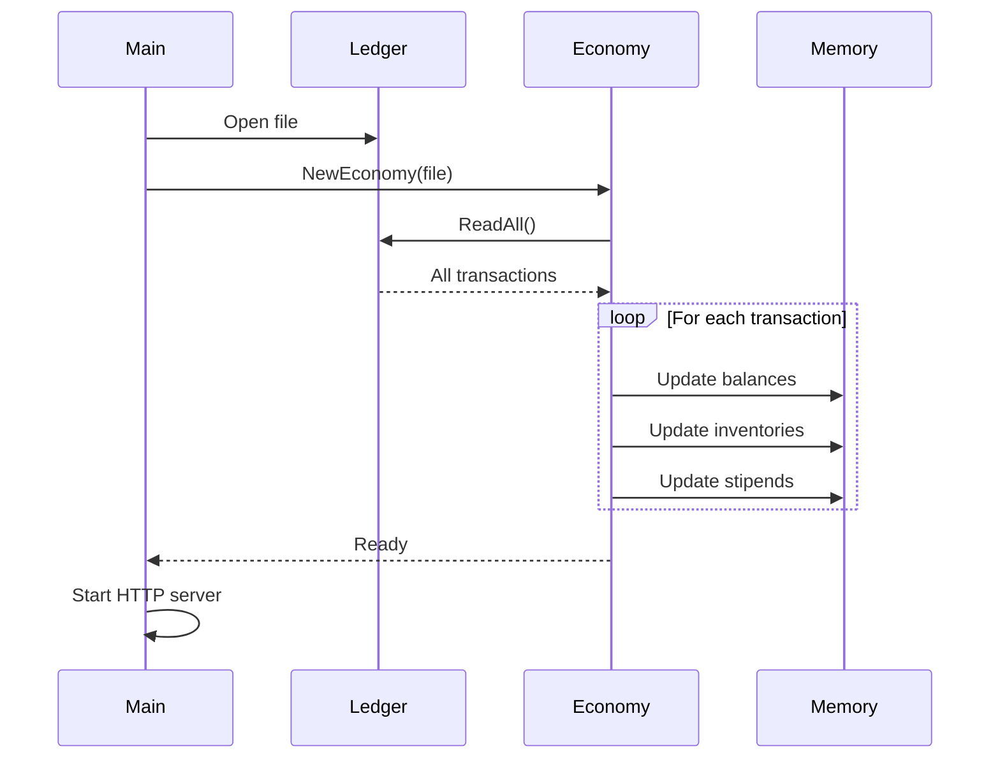
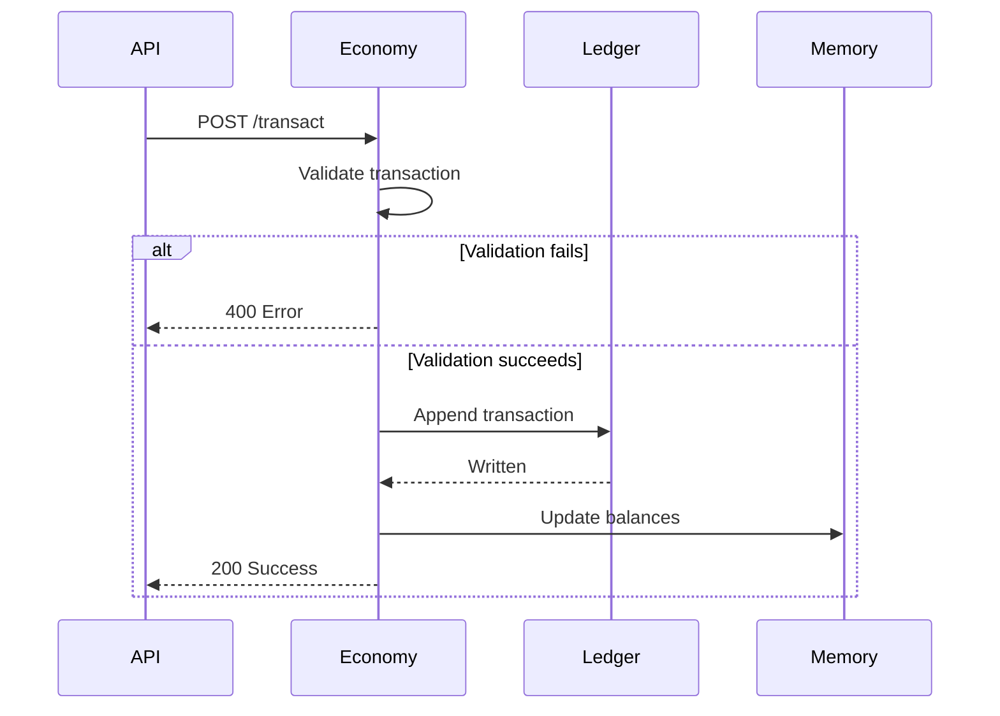

Mercury Core's economy system is a standalone microservice written in Go that manages virtual currency, transactions, and asset transfers using an append-only ledger.

## Design Philosophy

The economy is designed around several key principles:

> "imagine a blockchain but without the blocks or the chain" - Heliodex

- **Append-only ledger**: All transactions are immutable
- **No database dependencies**: Ledger is a simple JSONL file
- **In-memory computation**: Balances calculated from ledger on startup
- **Microservice architecture**: Independent of Site and Database services
- **Transaction atomicity**: All operations are all-or-nothing

## Currency System

### Currency Units

Currency is stored as an unsigned 64-bit integer with micro-precision:

```go
const (
  Micro Currency = 1
  Milli          = 1e3 * Micro      // 1,000 micro
  Unit           = 1e6 * Micro      // 1,000,000 micro (1 unit)
  Kilo           = 1e3 * Unit       // 1,000 units
  Mega           = 1e6 * Unit       // 1,000,000 units
  Giga           = 1e9 * Unit       // 1,000,000,000 units
  Tera           = 1e12 * Unit      // Max ~18 tera (uint64 limit)
)
```

**Example**: 10 units = 10,000,000 micro = `10000000` in storage

**Display Format**: `10.000000 unit`

### Economy Limits

- **Maximum per-user balance**: ~18 trillion units (uint64 max)
- **Maximum economy size**: Sum of all balances ≤ uint64 max
- **Precision**: 6 decimal places (micro-units)

### Stipends

Users receive free currency daily:

```go
const Stipend = 10 * Unit  // 10.000000 units
const stipendTime = 12 * 60 * 60 * 1000  // 12 hours in milliseconds
```

- **Amount**: 10 units per claim
- **Cooldown**: 12 hours between claims
- **Purpose**: Bootstrap new users and keep economy flowing

## Transaction Types

### Transaction (User-to-User)

Transfer currency between users.

```go
type SentTx struct {
  To, From User
  Amount   Currency
  Note     string
  Returns  Assets  // Optional: asset transfers
}
```

**Example**: Alice buys a hat from Bob for 5 units

```json
{
  "From": "user:alice",
  "To": "user:bob",
  "Amount": 5000000,
  "Note": "Purchased Cool Hat",
  "Link": "/catalog/123456789/cool-hat",
  "Returns": {},
  "Time": 1709481234567,
  "Id": "abc123xyz789"
}
```

**Validations**:
- Sender must have sufficient balance
- From and To must be different users
- Amount or Returns must be non-zero
- Note is required

### Mint (Currency Creation)

Create new currency from thin air (admin/stipend).

```go
type SentMint struct {
  To     User
  Amount Currency
  Note   string
}
```

**Example**: Daily stipend

```json
{
  "To": "user:alice",
  "Amount": 10000000,
  "Note": "Stipend",
  "Time": 1709481234567,
  "Id": "xyz789abc123"
}
```

**Validations**:
- Recipient must exist
- Amount must be positive
- Note is required

### Burn (Currency Destruction)

Remove currency from circulation (e.g., creation fees).

```go
type SentBurn struct {
  From       User
  Amount     Currency
  Note, Link string
  Returns    Assets  // Optional: newly created assets
}
```

**Example**: User creates an asset (pays creation fee)

```json
{
  "From": "user:alice",
  "Amount": 7500000,
  "Note": "Created asset Cool Hat",
  "Link": "/catalog/123456789/cool-hat",
  "Returns": {},
  "Time": 1709481234567,
  "Id": "burn123xyz"
}
```

**Validations**:
- Sender must have sufficient balance
- Amount must be positive
- Note and Link are required

## Ledger Architecture

### Storage Format

The ledger is stored as a JSONL (JSON Lines) file:

```
data/economy/ledger
```

Each line contains one transaction:

```
Transaction {"To":"user:bob","From":"user:alice","Amount":5000000,...}
Mint {"To":"user:alice","Amount":10000000,"Note":"Stipend",...}
Burn {"From":"user:alice","Amount":7500000,"Note":"Created asset",...}
```

### Startup Process



On startup, the service:

1. Opens the ledger file (creates if missing)
2. Reads all transactions into memory
3. Replays each transaction to build current state
4. Validates transaction integrity
5. Starts HTTP server

**Startup Output**:
```
Loading ledger...
User count     42
Transactions   1337
Economy size   420.000000 unit
CCU           10.000000 unit
~ Economy service is up on port 2009 ~
```

### In-Memory State

The service maintains three maps:

```go
type Economy struct {
  data         io.ReadWriteSeeker  // File handle
  balances     map[User]Currency   // Current balances
  inventories  map[User]Assets     // Asset ownership
  prevStipends map[User]uint64     // Last stipend timestamp
}
```

### Write Process



All transactions are:
1. Validated before writing
2. Appended to ledger file (atomic write)
3. Applied to in-memory state
4. Logged to console

**Transaction Log**:
```
Transaction successful  user:alice -[5.000000 unit]-> user:bob
Mint successful         user:alice <-[10.000000 unit]-
Burn successful         user:alice -[7.500000 unit]->
```

## Pricing Structure

Creation fees are calculated based on a base fee:

```typescript
// Site/src/lib/server/economy.ts
export const fee = 0.1;
const getFeeBasedPrice = (multiplier: number): number =>
  Math.round(fee * multiplier * 1e6);

export const getAssetPrice = () => getFeeBasedPrice(75);  // 7.5 units
export const getGroupPrice = () => getFeeBasedPrice(50);  // 5.0 units
```

**Current Prices**:
- **Asset creation**: 7.5 units (burned)
- **Group creation**: 5.0 units (burned)
- **Place creation**: Free (commented out)

These fees create deflationary pressure, balancing the inflationary stipends.

## Economy Metrics

The service tracks key metrics:

### User Count
```go
func (e *Economy) GetUserCount() int {
  return len(e.balances)
}
```

Number of users who have ever transacted.

### Economy Size
```go
func (e *Economy) GetEconomySize() (size Currency) {
  for _, v := range e.balances {
    size += v
  }
  return
}
```

Total currency in circulation (sum of all balances).

### Currency per User (CCU)
```go
func (e *Economy) CCU() Currency {
  users := len(e.balances)
  if users == 0 {
    return 0
  }
  return e.GetEconomySize() / Currency(users)
}
```

Average balance across all users.

## Asset System

The economy service supports asset ownership (currently unused):

```go
type AssetType string
type AssetId int
type Asset string  // "asset-123456789"
type Assets map[Asset]uint64  // Asset -> Quantity

const (
  TypeAsset AssetType = "asset"
  TypeGroup AssetType = "group"
  TypePlace AssetType = "place"
)
```

Assets can be transferred in transactions:

```json
{
  "From": "user:alice",
  "To": "user:bob",
  "Amount": 5000000,
  "Returns": {
    "asset-123456789": 1
  }
}
```

This would transfer 5 units from Alice to Bob, and transfer 1 copy of asset-123456789 from Bob to Alice.

**Note**: Currently, asset ownership is tracked in SurrealDB, not the economy ledger. The asset system in the economy service is reserved for future use.

## API Client (TypeScript)

The Site service includes a typed client:

```typescript
import { 
  getBalance, 
  getStipend,
  transact, 
  createAsset,
  createGroup 
} from '$lib/server/economy';

// Check balance
const balanceResult = await getBalance(fetch, 'user:alice');
if (balanceResult.ok) {
  console.log('Balance:', balanceResult.value, 'micro');
  // Balance: 50000000 micro (50.000000 units)
}

// Grant stipend
await stipend(fetch, 'user:alice');

// User-to-user transaction
const txResult = await transact(
  fetch,
  'user:alice',    // From
  'user:bob',      // To
  5000000,         // Amount (5 units)
  'Purchased hat', // Note
  '/catalog/123',  // Link
  {}               // Returns (asset transfers)
);

if (!txResult.ok) {
  console.error('Transaction failed:', txResult.msg);
}

// Create asset (burns fee)
const createResult = await createAsset(
  fetch,
  'user:alice',           // Creator
  123456789,              // Asset ID
  'Cool Hat',             // Name
  'cool-hat'              // Slug
);

if (!createResult.ok) {
  console.error('Insufficient balance for creation fee');
}
```

## Error Handling

### Insufficient Balance

```
invalid transaction: insufficient balance: balance was 2.500000 unit, at least 5.000000 unit is required
```

### Circular Transaction

```
invalid transaction: circular transaction: user:alice -> user:alice
```

### Stipend Cooldown

```
Next stipend not available yet
```

### Missing Fields

```
invalid transaction: transaction must have a note
```

## Ledger Integrity

The service validates ledger integrity on startup:

```go
if tx.Amount > e.balances[tx.From] {
  fmt.Println("Invalid transaction in ledger")
  os.Exit(1)
}
```

If any transaction would cause a negative balance, the service refuses to start. This ensures:

- No balance manipulation
- No currency duplication
- Append-only ledger is source of truth

**Manual Recovery**:

If the ledger becomes corrupted:

1. Stop the economy service
2. Edit `data/economy/ledger` to remove invalid lines
3. Restart the service
4. Verify balances with `/balance/:id`

## Transaction History

Get recent transactions:

```typescript
import { getTransactions, getAdminTransactions } from '$lib/server/economy';

// User's transactions (last 100)
const result = await getTransactions(fetch, 'user:alice');
if (result.ok) {
  for (const tx of result.value) {
    console.log(tx.Type, tx.From, '->', tx.To, tx.Amount);
  }
}

// All transactions (admin only)
const adminResult = await getAdminTransactions(fetch);
```

**Response Structure**:

```typescript
type ReceivedTx = {
  Id: string;
  Time: number;
  Note: string;
} & (
  | {
      Type: "Transaction";
      From: string;
      To: string;
      Amount: number;
      Link: string;
      Returns: number[];
      Fee: number;
    }
  | {
      Type: "Mint";
      To: string;
      Amount: number;
    }
  | {
      Type: "Burn";
      From: string;
      Amount: number;
      Link: string;
      Returns: number[];
    }
);
```

## User Display Transformation

The Site service transforms internal IDs to usernames:

```typescript
import { transformTransactions } from '$lib/server/economy';

const result = await getTransactions(fetch, userId);
if (result.ok) {
  const { transactions, users } = await transformTransactions(result.value);
  
  // transactions now have usernames instead of user:xxx IDs
  // users is a map of username -> {username, status}
}
```

This allows displaying "alice" instead of "user:abc123xyz" in transaction history.

## Economic Balance

### Inflationary Forces

- **Stipends**: 10 units per user every 12 hours
- **Daily rate**: ~20 units per active user

### Deflationary Forces

- **Asset creation**: 7.5 units burned per asset
- **Group creation**: 5.0 units burned per group

### Target Economics

```go
// Commented out - future dynamic fee system
// const TCU = float64(100 * Unit)  // Target Currency per User
```

A future enhancement could dynamically adjust stipends and fees to maintain a target economy size per user.

## Performance Characteristics

### Startup Time

O(n) where n = number of transactions in ledger

- 1,000 transactions: ~10ms
- 10,000 transactions: ~100ms
- 100,000 transactions: ~1s

### Runtime Performance

All operations are O(1) hash map lookups:

- Balance query: < 1μs
- Transaction write: < 100μs (file append)
- Transaction history: O(n) scan of ledger

### Memory Usage

Approximate memory per user:

- Balance: 8 bytes (uint64)
- User ID: ~20 bytes (string)
- Stipend time: 8 bytes (uint64)

**Total**: ~40 bytes per user + ledger file size

## Backup and Recovery

### Backup

Simply copy the ledger file:

```bash
cp data/economy/ledger data/economy/ledger.backup
```

### Restore

```bash
# Stop the economy service
docker compose stop economy

# Restore ledger
cp data/economy/ledger.backup data/economy/ledger

# Restart service (will rebuild state from ledger)
docker compose start economy
```

### Disaster Recovery

If the ledger is lost but database is intact:

1. Query all user balances from your records
2. Create a new ledger with Mint transactions
3. Restart the economy service

**Note**: Transaction history will be lost, but balances can be restored.

## Future Enhancements

Potential improvements to the economy system:

- **Dynamic fees**: Adjust based on economy size (TCU target)
- **Asset transfers**: Use ledger for asset ownership instead of database
- **Sharding**: Split ledger by time period for faster startup
- **Snapshots**: Periodic balance snapshots to speed up loading
- **Analytics**: Transaction graphs, velocity metrics, inflation rate
- **Multi-currency**: Support for multiple currency types
